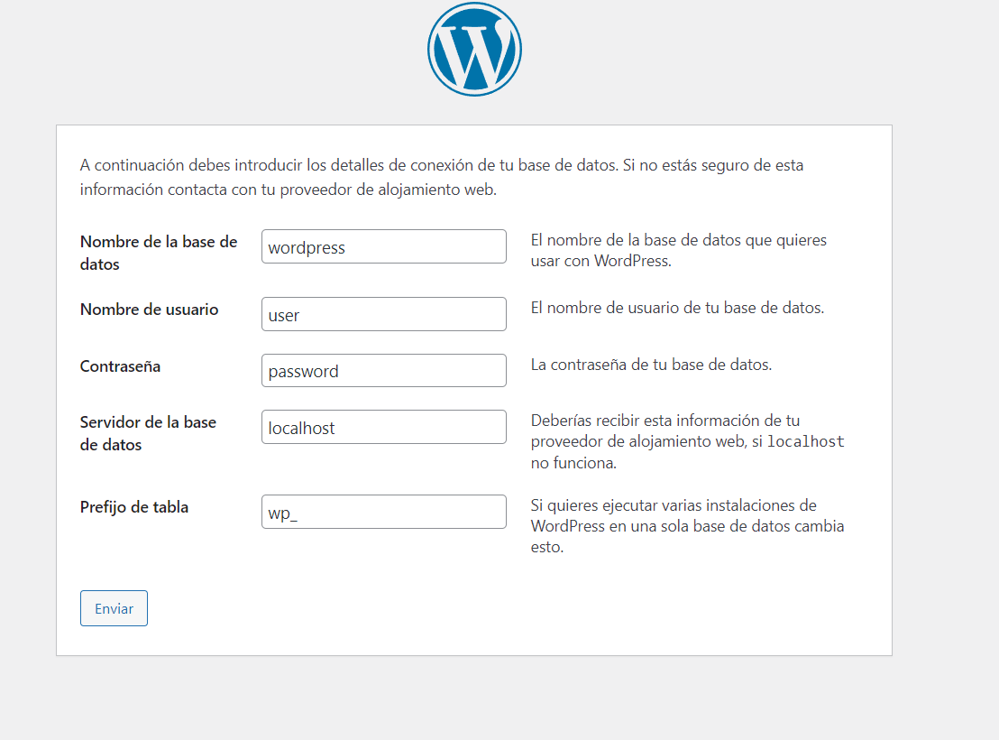
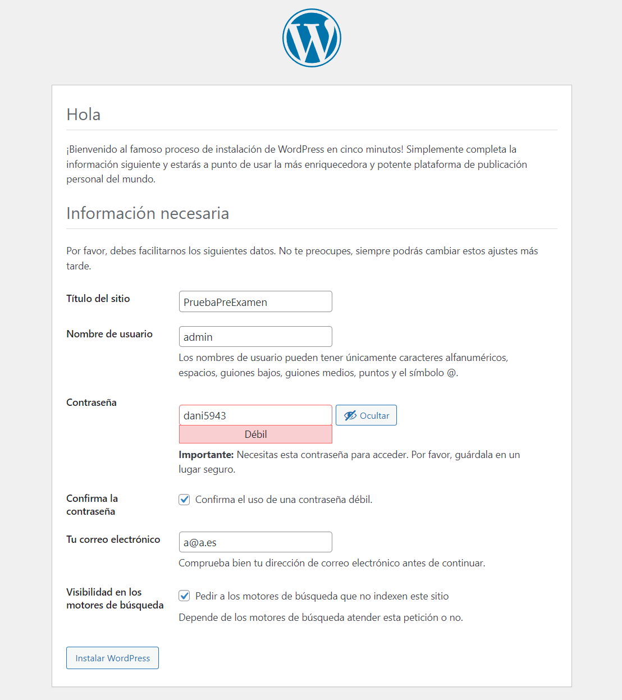

# INSTALACION WORDPRESS

**NECESARIO INSTALAR EN UN ENTORNO LAMP**

Empezamos instalando los paquetes, en una `terminal`

```bash
    apt install mariadb-client mariadb-server php php-mysql apache2 libapache2-mod-php
```

## CREACION Y ACCESO A BASE DE DATOS Y CREACIÓN DE UN USUARIO PARA LA CONEXIÓN

Accedemos a MariaDB

```bash
mysql -u root -p
```

Creamos la base de datos:

```MariaDB
create database wordpress;
```

Creamos el usuario para la base de datos:

```MariaDB
create user 'user'@'localhost';
```

Asignamos el usuario a la base de datos:

```MariaDB
grant all privileges on wordpress.* to 'user'@'localhost' identified by 'password';
```

Flush:

```MariaDB
flush privileges;
exit;
```

Nos dirigimos al DocumentRoot por defecto de `Apache` : `var/www/html/`

```bash
cd /var/www/html
```

Este va a ser el directorio donde vamos a descargar nuestro _Wordpress_.

```bash
wget https://es.wordpress.org/latest-es_ES.zip
```

---
_OPCIONAL_

Para descomprimir el archivo vamos a utilizar `unzip`, en caso de que no este instalado:

```bash
apt get insall unzip
```

---

A continuación descomprimos la carpeta de `WordPress`:

```bash
unzip latest-es_ES.zip
```

**Importante** cambiar el propietario de `/var/www/html`

```bash
chown -R www-data:www-data html/
```

A través de un navegador accedemos a http://localhost:8080/wordpress/wp-admin/setup-config.php




